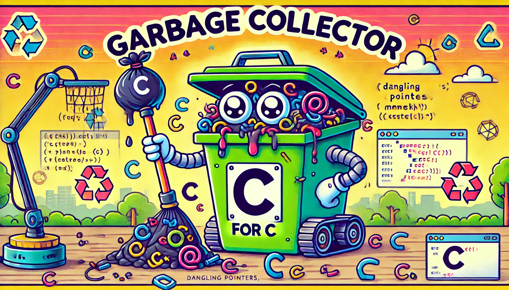

<div align="center">
<h1>My Garbage Collector</h1>


</br>
</br>

<strong>Simple garbage collector in C to manage dynamic memory allocations.</strong>


</br>


</div>

</br>

## Initialization

#### Initialize the garbage collector:
```c
t_gc	*gc;
gc = gc_init();
```

</br>

## Add to the garbage collector

```c
char *str = strdup("Hello, 42 !");
if (!str)
{
	gc_clean(gc);
	return (1);
}
gc_add(gc, (void *)str);
```

</br>

## Clean

#### Remove and free one:
```c
gc_remove_one(gc, (void *)str);
```

</br>

#### Remove and free all:
```c
gc_clean(gc);
```

</br>

## Debug

#### Print all allocations in the garbage collector:
```c
gc_print_debug(gc);
```
